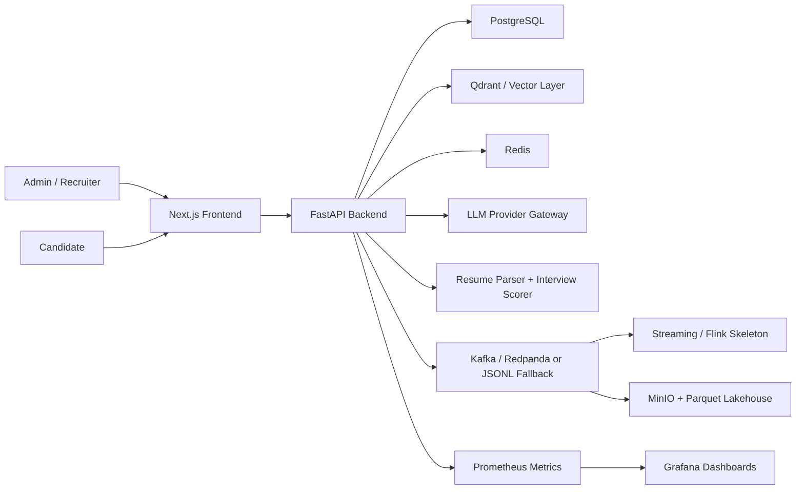

# HireOS AI

AI-powered interview, screening, and hiring intelligence platform for recruiters and companies.

HireOS AI is built as a production-style SaaS starter, not a demo chatbot. It combines recruiter-owned workflows, explainable AI scoring, event-driven analytics, and responsible-hiring safeguards into a single local demo stack.

## What it does

- Creates company workspaces with JWT auth and RBAC for `admin`, `recruiter`, `candidate`, and `hiring_manager`
- Lets recruiters create jobs, parse job descriptions, upload resumes, and generate AI-assisted match results
- Runs structured AI interview flows with question plans, answer scoring, follow-up guidance, and report generation
- Shows recruiter dashboards, candidate ranking, analytics, and override-friendly human review workflows
- Emits lifecycle events to Kafka when available, or local JSONL when running lightweight
- Includes local observability, lakehouse-ready analytics assets, and evaluation scaffolding

## Architecture

## Repo map

- [backend](/Users/dubeyroh/Library/CloudStorage/OneDrive-TheStarsGroup/Desktop/HireOs/backend): FastAPI app, SQLAlchemy models, auth, scoring, events, analytics, seed script, tests
- [frontend](/Users/dubeyroh/Library/CloudStorage/OneDrive-TheStarsGroup/Desktop/HireOs/frontend): Next.js SaaS UI for recruiter, admin, and candidate flows
- [docs](/Users/dubeyroh/Library/CloudStorage/OneDrive-TheStarsGroup/Desktop/HireOs/docs): architecture, API, events, data model, responsible AI, demo script, business model
- [infra](/Users/dubeyroh/Library/CloudStorage/OneDrive-TheStarsGroup/Desktop/HireOs/infra): Docker Compose dependencies, Prometheus, Grafana, Kafka topics, Flink skeleton, Terraform starter
- [data](/Users/dubeyroh/Library/CloudStorage/OneDrive-TheStarsGroup/Desktop/HireOs/data): golden evaluation set, sample resumes, analytics SQL
- [scripts](/Users/dubeyroh/Library/CloudStorage/OneDrive-TheStarsGroup/Desktop/HireOs/scripts): scoring evaluation batch job

## Tech stack

- Frontend: Next.js, TypeScript, Tailwind CSS, TanStack Query, Recharts
- Backend: FastAPI, Pydantic, SQLAlchemy, Alembic, JWT auth
- Storage: PostgreSQL, local file uploads, JSONL event fallback
- AI layer: provider abstraction for OpenAI-compatible APIs or Ollama, with deterministic mock behavior for local runs
- Data platform: Redpanda/Kafka, MinIO, Parquet-ready lakehouse structure, Flink job skeleton
- Observability: Prometheus, Grafana, structured event/audit records

## Local demo

1. Copy `.env.example` to `.env`
   - if you want Google sign-in or Google Meet auto-scheduling, also set `GOOGLE_CLIENT_ID`, `GOOGLE_CLIENT_SECRET`, `GOOGLE_AUTH_REDIRECT_URI`, and `GOOGLE_OAUTH_REDIRECT_URI`
2. Quick start in one command:
   - `bash scripts/run_everything.sh`
   - or `make run-all`
   - the runner will automatically stop stale processes already listening on ports `3000` and `8000`, and clear an old `Next.js` dev lock if needed
3. Manual backend-only local run:
   - `cd backend`
   - `python3 -m venv .venv`
   - `source .venv/bin/activate`
   - `pip install -r requirements.txt`
   - `python seed.py`
   - `python -m uvicorn app.main:app --reload`
4. Manual frontend local run:
   - `cd frontend`
   - `npm install`
   - `npm run dev`
5. Open `http://localhost:3000`
6. Login with `recruiter1@hireos.ai / Demo@123`

Docker users can use `make up`, but Docker was not available in the build environment used for validation here, so Compose is included but not executed in this session.

## Demo flow

1. Recruiter logs in
2. Creates or opens a job
3. Uploads a candidate resume
4. Runs AI resume match
5. Invites candidate to interview
6. Candidate completes the text interview flow
7. Backend scores answers and generates a report
8. Recruiter opens ranking, reports, and analytics views

## Screenshots

- Landing page placeholder: use `/`
- Recruiter dashboard placeholder: use `/dashboard`
- Candidate interview placeholder: use `/interview/{interview_id}`

## Testing

- Backend tests: `cd backend && source .venv/bin/activate && pytest`
- Frontend lint and production build: `cd frontend && npm run lint && npm run build`
- Scoring evaluation batch: `python scripts/run_scoring_eval.py`

## Docs

- [Architecture](/Users/dubeyroh/Library/CloudStorage/OneDrive-TheStarsGroup/Desktop/HireOs/docs/architecture.md)
- [API](/Users/dubeyroh/Library/CloudStorage/OneDrive-TheStarsGroup/Desktop/HireOs/docs/api.md)
- [Event contracts](/Users/dubeyroh/Library/CloudStorage/OneDrive-TheStarsGroup/Desktop/HireOs/docs/event_contracts.md)
- [Data model](/Users/dubeyroh/Library/CloudStorage/OneDrive-TheStarsGroup/Desktop/HireOs/docs/data_model.md)
- [Responsible AI hiring](/Users/dubeyroh/Library/CloudStorage/OneDrive-TheStarsGroup/Desktop/HireOs/docs/responsible_ai_hiring.md)
- [Local setup](/Users/dubeyroh/Library/CloudStorage/OneDrive-TheStarsGroup/Desktop/HireOs/docs/local_setup.md)
- [Business model](/Users/dubeyroh/Library/CloudStorage/OneDrive-TheStarsGroup/Desktop/HireOs/docs/business_model.md)
- [Demo script](/Users/dubeyroh/Library/CloudStorage/OneDrive-TheStarsGroup/Desktop/HireOs/docs/demo_script.md)

## Roadmap

- MVP
  - Job creation
  - Resume upload and parsing
  - AI match
  - AI interview
  - Explainable scoring
  - Recruiter report
  - Dashboard
- V1
  - Kafka events
  - Analytics expansion
  - Observability hardening
  - Batch evals
  - Candidate ranking refinements
- V2
  - Video interviews
  - Calendar integration
  - ATS integration
  - Slack/email notifications
  - Enterprise SSO
  - Advanced fairness analysis
- V3
  - Multi-language interviews
  - Custom scoring rubrics
  - Marketplace integrations
  - Human interviewer copilot
