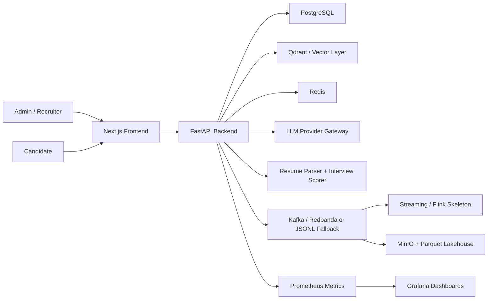

# HireOS AI

AI-powered interview, screening, and hiring intelligence platform for recruiters and companies.

HireOS AI is built as a production-style SaaS starter, not a demo chatbot. It combines recruiter-owned workflows, explainable AI scoring, event-driven analytics, and responsible-hiring safeguards into a single local demo stack.

## What it does

- Creates company workspaces with JWT auth and RBAC for `admin`, `recruiter`, `candidate`, and `hiring_manager`
- Lets recruiters create jobs, parse job descriptions, upload resumes, and generate AI-assisted match results
- Redacts protected-attribute signals from resumes and candidate answers before AI matching or scoring
- Runs structured AI interview flows with question plans, answer scoring, follow-up guidance, and report generation
- Shows recruiter dashboards, candidate ranking, analytics, and override-friendly human review workflows
- Captures hiring manager recommendations separately from recruiter final decisions so collaborative review never removes recruiter control
- Shows a calibration-style consensus scorecard so teams can see when AI, hiring manager, and recruiter signals align or need escalation
- Pushes recruiter-approved shortlist decisions into external ATS/webhook systems with delivery history and manual retry
- Protects candidate interview access with expiring magic links that recruiters can refresh or revoke without exposing interview IDs alone
- Emits lifecycle events to Kafka when available, or local JSONL when running lightweight
- Includes local observability, lakehouse-ready analytics assets, and evaluation scaffolding

## Architecture



## Repo map

- [backend](/Users/dubeyroh/Library/CloudStorage/OneDrive-TheStarsGroup/Desktop/HireOs/backend): FastAPI app, SQLAlchemy models, auth, scoring, events, analytics, seed script, tests
- [frontend](/Users/dubeyroh/Library/CloudStorage/OneDrive-TheStarsGroup/Desktop/HireOs/frontend): Next.js SaaS UI for recruiter, admin, and candidate flows
- [docs](/Users/dubeyroh/Library/CloudStorage/OneDrive-TheStarsGroup/Desktop/HireOs/docs): architecture, API, events, data model, responsible AI, demo script, business model
- [infra](/Users/dubeyroh/Library/CloudStorage/OneDrive-TheStarsGroup/Desktop/HireOs/infra): Docker Compose dependencies, Prometheus, Grafana, Kafka topics, Flink skeleton, Terraform starter
- [data](/Users/dubeyroh/Library/CloudStorage/OneDrive-TheStarsGroup/Desktop/HireOs/data): golden evaluation set, sample resumes, analytics SQL
- [scripts](/Users/dubeyroh/Library/CloudStorage/OneDrive-TheStarsGroup/Desktop/HireOs/scripts): scoring evaluation batch job

## Tech stack

- Frontend: Next.js, TypeScript, Tailwind CSS, TanStack Query, Recharts
- Backend: FastAPI, Pydantic, SQLAlchemy, Alembic, JWT auth
- Storage: PostgreSQL, local file uploads, JSONL event fallback
- AI layer: provider abstraction for OpenAI-compatible APIs or Ollama, with deterministic mock behavior for local runs
- Data platform: Redpanda/Kafka, MinIO, Parquet-ready lakehouse structure, Flink job skeleton
- Observability: Prometheus, Grafana, structured event/audit records

## Local demo

1. Copy `.env.example` to `.env`
   - for production, set `FIELD_ENCRYPTION_KEY` so provider refresh tokens, access tokens, webhook bearer tokens, and signing secrets are encrypted at rest with a dedicated key
   - if you want Google sign-in or Google Meet auto-scheduling, also set `GOOGLE_CLIENT_ID`, `GOOGLE_CLIENT_SECRET`, `GOOGLE_AUTH_REDIRECT_URI`, and `GOOGLE_OAUTH_REDIRECT_URI`
   - if you want Zoom auto-scheduling with real meeting creation, also set `ZOOM_CLIENT_ID`, `ZOOM_CLIENT_SECRET`, and `ZOOM_OAUTH_REDIRECT_URI`
   - if you want HireOS to send interview emails directly instead of only opening a `mailto:` draft, also set:
     - `SMTP_HOST`
     - `SMTP_PORT`
     - `SMTP_USERNAME`
     - `SMTP_PASSWORD`
     - `SMTP_FROM_EMAIL`
     - `SMTP_FROM_NAME`
     - `SMTP_USE_TLS`
   - if SMTP is left blank, HireOS still works and writes fallback invite payloads to `data/email_outbox/` for local demo use
   - if you want automatic ATS/webhook handoff after recruiter shortlist decisions, optionally set `ATS_WEBHOOK_TIMEOUT_SECONDS` and then configure the webhook endpoint in `Settings`
   - adjust `INTERVIEW_MAGIC_LINK_TTL_HOURS` if you want candidate interview invites to expire faster or stay active longer
2. Quick start in one command:
   - `bash scripts/run_everything.sh`
   - or `make run-all`
   - the runner will automatically stop stale processes already listening on ports `3000` and `8000`, and clear an old `Next.js` dev lock if needed
3. Manual backend-only local run:
   - `cd backend`
   - `python3 -m venv .venv`
   - `source .venv/bin/activate`
   - `pip install -r requirements.txt`
   - `python seed.py`
   - `python -m uvicorn app.main:app --reload`
4. Manual frontend local run:
   - `cd frontend`
   - `npm install`
   - `npm run dev`
5. Open `http://localhost:3000`
6. Login with `recruiter1@hireos.ai / Demo@123`

Docker users can use `make up`, but Docker was not available in the build environment used for validation here, so Compose is included but not executed in this session.

### SMTP example

```env
SMTP_HOST=smtp.example.com
SMTP_PORT=587
SMTP_USERNAME=apikey-or-username
SMTP_PASSWORD=super-secret-password
SMTP_FROM_EMAIL=noreply@yourcompany.com
SMTP_FROM_NAME=HireOS AI
SMTP_USE_TLS=true
```

Use these when you want the `Send with HireOS` button on the candidate invite screen to deliver real emails through your mail provider.

### ATS webhook export

- Configure the endpoint from `/settings`
- Supported automatic export stages: `shortlisted`, `moved_to_next_round`, `hired`
- HireOS signs webhook bodies with `X-HireOS-Signature` when you store a signing secret
- Failed exports never block recruiter decisions; recruiters can retry from the candidate decision workspace

### Candidate magic links

- Every async HireOS interview invite now uses a signed candidate magic link instead of relying on a bare interview ID
- Recruiters can refresh a link to invalidate an older invite, or revoke access completely from the candidate detail workspace
- Reminder emails reuse the active link and stop sending once an interview link has been revoked
- Default expiry is controlled by `INTERVIEW_MAGIC_LINK_TTL_HOURS`

### Bias shield

- Resume uploads now pass through a fairness guard before AI parsing and matching
- Candidate interview answers are sanitized for protected-attribute references before semantic scoring
- Recruiters can see whether redaction ran, how many signals were removed, and which protected-signal categories were detected
- The original resume is still retained for human review, but AI processing uses the sanitized version

### Secret storage

- HireOS encrypts stored Google integration tokens and ATS webhook secrets before writing them into the database
- Set `FIELD_ENCRYPTION_KEY` in production so encryption uses a dedicated secret instead of falling back to the app JWT secret
- If you rotate `FIELD_ENCRYPTION_KEY`, previously stored provider secrets must be reconnected or re-entered unless you perform a controlled re-encryption migration

### How to use encrypted provider secrets

1. Add a strong `FIELD_ENCRYPTION_KEY` to `.env`
2. Start the app with `bash scripts/run_everything.sh`
3. Open `Settings`
4. Configure either:
   - `Google Meet integration` by connecting Google
   - `ATS webhook export` by saving the endpoint URL and optional bearer token or signing secret
5. Submit the integration settings normally from the UI

What happens after save:
- HireOS encrypts Google access tokens, Google refresh tokens, ATS bearer tokens, and ATS signing secrets before storing them in `companies.settings_json`
- API responses only return connection status and `has_*` flags, not the raw secret values
- Existing plaintext provider secrets remain readable for backward compatibility, and any updated values are rewritten encrypted

Operational notes:
- For local dev, if `FIELD_ENCRYPTION_KEY` is blank, HireOS derives encryption from `JWT_SECRET`
- For production, always set a dedicated `FIELD_ENCRYPTION_KEY`
- If you change `FIELD_ENCRYPTION_KEY`, reconnect Google and re-enter ATS secrets unless you run a re-encryption migration

### Live meeting auto-scheduling

1. Add Google and/or Zoom OAuth settings in `.env`
2. Start HireOS and open `/settings`
3. Connect `Google Meet integration` if you want HireOS to create Calendar events with Meet links
4. Connect `Zoom integration` if you want HireOS to create real Zoom meetings automatically
5. Open a candidate
6. Choose `Video interview`
7. Choose `Google Meet` or `Zoom`
8. Leave `Live meeting join URL` blank to let HireOS auto-create the meeting
9. Choose `Ad hoc now` or `Scheduled for later`
10. Click `Invite to interview`

What happens:
- `Google Meet`: HireOS creates a Calendar event with conference data and stores the returned Meet join URL
- `Zoom`: HireOS creates a real Zoom meeting and stores the returned Zoom join URL
- If no provider is connected, recruiters can still paste an existing meeting URL manually

### Hiring manager feedback workflow

1. Open a candidate profile
2. Select a job so the review workspace loads
3. Invite the candidate if no interview exists yet
4. Have an `admin` or `hiring_manager` open the candidate review page
5. Use `Hiring manager feedback` to record a recommendation, notes, and the suggested next round
6. Let the recruiter compare that input against AI signals before saving the final pipeline decision

What happens:
- Manager feedback is stored separately from recruiter decisions
- Audit timeline entries and event records capture the feedback action
- Recruiters can see the full manager history without losing ownership of the final shortlist, reject, or hire state

### Decision consensus

- Candidate review pages now include a consensus scorecard that normalizes:
  - `HireOS AI` match recommendation
  - `Hiring manager` recommendation
  - `Recruiter` final decision
- HireOS computes an agreement score, flags whether escalation is required, and lists the specific conflicts that need calibration
- This helps teams catch cases where one reviewer advances a candidate while another rejects them, even if the AI score looks strong

## Demo flow

1. Recruiter logs in
2. Creates or opens a job
3. Uploads a candidate resume
4. Runs AI resume match
5. Invites candidate to interview
6. Candidate completes the text interview flow
7. Backend scores answers and generates a report
8. Recruiter opens ranking, reports, and analytics views

## Screenshots

- Landing page placeholder: use `/`
- Recruiter dashboard placeholder: use `/dashboard`
- Candidate interview placeholder: use `/interview/{interview_id}`

## Testing

- Backend tests: `cd backend && source .venv/bin/activate && pytest`
- Frontend lint and production build: `cd frontend && npm run lint && npm run build`
- Scoring evaluation batch: `python scripts/run_scoring_eval.py`

## Docs

- [Architecture](/Users/dubeyroh/Library/CloudStorage/OneDrive-TheStarsGroup/Desktop/HireOs/docs/architecture.md)
- [API](/Users/dubeyroh/Library/CloudStorage/OneDrive-TheStarsGroup/Desktop/HireOs/docs/api.md)
- [Event contracts](/Users/dubeyroh/Library/CloudStorage/OneDrive-TheStarsGroup/Desktop/HireOs/docs/event_contracts.md)
- [Data model](/Users/dubeyroh/Library/CloudStorage/OneDrive-TheStarsGroup/Desktop/HireOs/docs/data_model.md)
- [Responsible AI hiring](/Users/dubeyroh/Library/CloudStorage/OneDrive-TheStarsGroup/Desktop/HireOs/docs/responsible_ai_hiring.md)
- [Local setup](/Users/dubeyroh/Library/CloudStorage/OneDrive-TheStarsGroup/Desktop/HireOs/docs/local_setup.md)
- [Business model](/Users/dubeyroh/Library/CloudStorage/OneDrive-TheStarsGroup/Desktop/HireOs/docs/business_model.md)
- [Demo script](/Users/dubeyroh/Library/CloudStorage/OneDrive-TheStarsGroup/Desktop/HireOs/docs/demo_script.md)

## Roadmap

- MVP
  - Job creation
  - Resume upload and parsing
  - AI match
  - AI interview
  - Explainable scoring
  - Recruiter report
  - Dashboard
- V1
  - Kafka events
  - Analytics expansion
  - Observability hardening
  - Batch evals
  - Candidate ranking refinements
- V2
  - Video interviews
  - Calendar integration
  - ATS integration
  - Slack/email notifications
  - Enterprise SSO
  - Advanced fairness analysis
- V3
  - Multi-language interviews
  - Custom scoring rubrics
  - Marketplace integrations
  - Human interviewer copilot
